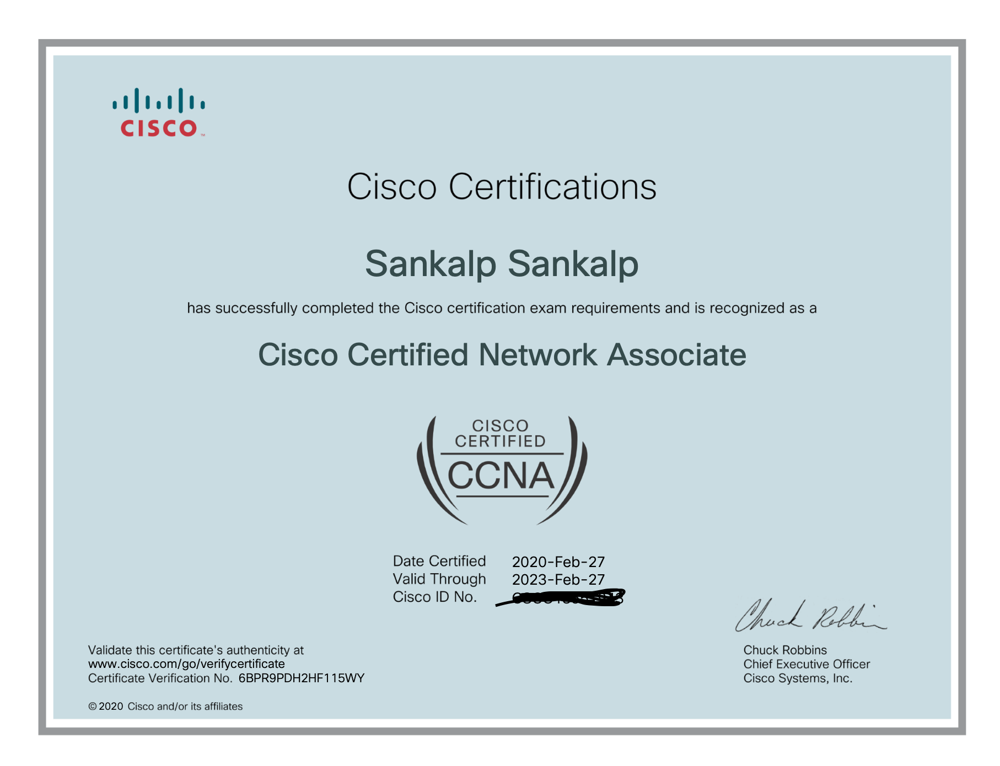

# CCNA Labs - Cisco Packet Tracer

When I was studying for CCNA exam, I solved so many virtual lab questions on Cisco Packet Tracer. 

Cisco Packet Tracer provides virtual simulation set-up of networking devices to run, test and interact with, to mimic real life networking scenarios, before deploying in reality (or so what I think about them)

Here I try to show different networking simulation scenarious, and lab description to show different netwokring capabilities I learnt during early 2020.

